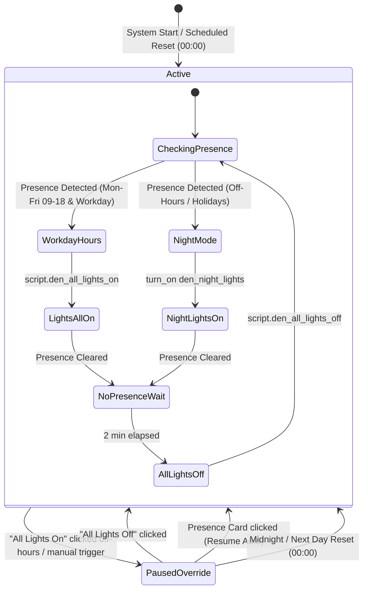

# Implementation Plan: Den FP300 Presence Adaptive Lighting & Holiday-Aware Scheduling

**Date**: 2026-10-03  
**Status**: Proposed  
**Scope**: FP300 mmWave presence automation in the Den, Vancouver/BC statutory holiday scheduling, `den_night_lights` label grouping, dashboard presence override controls, and adaptive lighting transitions.

---

## 1. Overview & Context

This implementation introduces presence-based lighting automation for the Den utilizing the **Aqara FP300** multi-sensor (`binary_sensor.fp300_den_presence`).

Key architectural goals:
1. **Adaptive Scheduling**:
   - **Workdays (09:00 - 18:00)**: Turn ON all Den lights on presence; turn OFF after 2 minutes of absence.
   - **Off-Hours & Non-Work Days**: Turn ON only fixtures labeled with `den_night_lights` (currently `light.den_night_light`); turn OFF after 2 minutes of absence.
2. **Vancouver / BC Statutory Holiday & Vacation Calendar**:
   - Automatically detect statutory holidays in British Columbia via Home Assistant's `workday` integration (`country: CA`, `province: BC`).
   - Provide a local calendar (`calendar.den_holidays`) allowing user-scheduled vacation/time off to automatically treat days as non-work days.
3. **Manual Override & Presence Control State Machine**:
   - Manually pressing "All Lights On" on non-work days/off-hours suspends presence automation for the rest of the day (or until "All Lights Off" is tapped).
   - The NSPanel dashboard displays the presence status (e.g., `Active (Occupied)`, `Active (Clear)`, `Paused (Resumes Tomorrow)`).
   - Tapping the presence card restores automation without abruptly altering existing light states.
   - Absence for 2 minutes still turns off lights once presence automation is restored.
   - Automatic midnight reset ensures the next workday begins clean.
4. **Label Architecture**:
   - Introduce `den_night_lights` label so additional fixtures can be added to the night mode in the future without modifying automations or code.

---

## 2. User Review & Key Decisions

> [!IMPORTANT]
> **1. Vancouver / BC Statutory Holidays & Custom Calendar**:
> - **Clean Calendar-Only Model**: Rather than using the built-in `workday` integration (which clutters the Home Assistant calendar UI with Mon–Fri "Workday" events), weekdays (Mon–Fri) are treated as standard workdays in code (`now().weekday() < 5`).
> - **Local Calendar (`calendar.den_holidays`)**: Holds only official British Columbia statutory holidays (pre-populated for 2026 & 2027) plus any user-added vacation days or time off. The calendar remains clean and easy to read.
> - Combined sensor: `binary_sensor.den_is_workday` (`now().weekday() < 5 and is_state('calendar.den_holidays', 'off')`).

> [!IMPORTANT]
> **2. Presence Absence Delay (2 Minutes)**:
> - The FP300 hardware currently has an absence delay timer of 10s (`number.fp300_den_absence_delay_timer`).
> - The automation uses a 2-minute absence buffer (`for: "00:02:00"`) on `binary_sensor.fp300_den_presence` to prevent brief departures or sitting still from cutting the lights.

> [!IMPORTANT]
> **3. Override & Dashboard Behavior**:
> - Clicking "All Lights On" on non-work days / off-hours activates `input_boolean.den_presence_override`, displaying `Paused (Resumes Tomorrow)` on the dashboard.
> - Clicking "All Lights Off" turns off all lights and immediately clears the override, returning presence automation to `Active`.
> - Clicking the Presence button immediately clears the override without changing current lighting; lights turn off 2 minutes after departure.
> - At 00:00 midnight, any active temporary override is automatically reset.

> [!NOTE]
> **4. Simplicity & Windowless Design**:
> - The Den has no windows and is naturally dim throughout the day.
> - Lux-gating is deliberately omitted: presence always turns on lights according to schedule (workday all-lights vs. off-hours night lights), ensuring instant, reliable response with zero unnecessary complexity.

---

## 3. Architecture & State Machine



---

## 4. Proposed Changes

### A. Label Registry
- Create label `den_night_lights`:
  - **ID**: `den_night_lights`
  - **Name**: `Den Night Lights`
  - **Icon**: `mdi:weather-night`
  - **Color**: `purple`
  - **Description**: `Fixtures activated for night/off-hours presence in the Den`
- Tag night lighting fixtures with `den_night_lights`:
  - `light.den_night_light` (Fan Night Light, also tagged `git_managed`)
  - `switch.den_floor_lamp_side_light` (Den Floor Lamp Side Light)
  - `light.humidifier_night_light` (Govee Humidifier Night Light)

### B. Integrations & Calendars
- Add `local_calendar` integration with calendar name `Den Holidays` (`calendar.den_holidays`), pre-populated with 2026/2027 official British Columbia statutory holidays.

### C. Helpers (`helpers/den_lighting_helpers.yaml`)
- `input_boolean.den_presence_automation` (Master enable/disable)
- `input_boolean.den_presence_override` (Temporary daily pause indicator)

### D. Templates (`templates/den_sensors.yaml`)
- `binary_sensor.den_is_workday`:
  ```jinja2
  {{ now().weekday() < 5 and is_state('calendar.den_holidays', 'off') }}
  ```
- `sensor.den_presence_status`:
  Displays `Active (Occupied)`, `Active (Clear)`, `Paused (Resumes Tomorrow)`, or `Disabled`.

### E. Scripts (`scripts/`)
- Modify `scripts/den_all_lights_on.yaml`: Set `den_presence_override` to `on` when called outside work hours or from UI.
- Modify `scripts/den_all_lights_off.yaml`: Clear `den_presence_override` to `off`.
- New `scripts/den_presence_toggle.yaml`: Toggle or restore presence automation state without changing lights.

### F. Automations (`automations/`)
- New `automations/den_presence_lighting.yaml`:
  - Triggers on FP300 presence `on`, absence `off` (for 2 min), `09:00:00` workday morning transition, and `00:00:00` daily reset.
  - Automatically transitions active occupants from Night Lights to full workday lighting at 09:00:00.
  - Absence for 2 minutes reliably turns off both `den_night_lights` and `script.den_all_lights_off`.

### G. Dashboard (`dashboards/nspanel-den.yaml`)
- Add a presence button/card in the Den Controls section showing status, occupancy badge, and one-tap restore.

---

## 5. Verification Plan

1. **YAML Syntax Validation**: Run checks on all modified and newly created YAML files.
2. **MCP Live Verification**:
   - Test `binary_sensor.workday` evaluates correctly for Vancouver/BC.
   - Test `calendar.den_holidays` registration.
   - Test `label_entities('den_night_lights')` returns `['light.den_night_light']`.
   - Verify `sensor.den_presence_status` template logic using `ha_eval_template`.
   - Validate live automation trigger execution.
3. **Manual User Testing**:
   - Off-hours entry: night light turns on.
   - Absence for 2 minutes: light turns off.
   - Tapping "All Lights On": status shows `Paused (Resumes Tomorrow)`.
   - Tapping Presence button: status restores to `Active` without turning off existing light.
